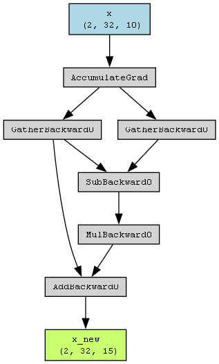

# linearInterp
experiment of linear interpolation based on PyTorch.

## 用途

类似于cosyvoice模型，对音频时序进行插值，从25Hz的时序长度扩到50Hz，对齐到目标音频合成频率.

## 核心代码

线性插值实现

```
def linear_interp(x,target_seq_size):
    i_new=torch.linspace(0,x.shape[2]-1,steps=target_seq_size)
    i_new_left=i_new.view(1,1,target_seq_size).expand(x.size(0),x.size(1),-1).floor().long()
    i_new_right=torch.clamp(i_new_left+1,0,x.size(2)-1)

    x_new_left=torch.gather(x,dim=2,index=i_new_left)
    x_new_right=torch.gather(x,dim=2,index=i_new_right)

    i_new_weight=i_new.view(1,1,target_seq_size).expand(x.size(0),x.size(1),-1)-i_new_left
    x_new=x_new_left+(x_new_right-x_new_left)*i_new_weight
    return x_new
```

测试代码

```
x_new=linear_interp(x,target_seq_size)
x_new_torch=torch.nn.functional.interpolate(x,size=(target_seq_size,),mode='linear',align_corners=True)
print(f'【测试结论】\n第0维特征:{x_new[0][0]}\n第1维特征:{x_new[0][1]}\n与torch官方一致性:{torch.all(torch.abs(x_new-x_new_torch)<1e-5)}')
```

插值结果与torch官方一致

```
【测试结论】
第0维特征:tensor([ 0.0000,  1.2857,  2.5714,  3.8571,  5.1429,  6.4286,  7.7143,  9.0000,
        10.2857, 11.5714, 12.8571, 14.1429, 15.4286, 16.7143, 18.0000],
       dtype=torch.float64)
第1维特征:tensor([20.0000, 21.2857, 22.5714, 23.8571, 25.1429, 26.4286, 27.7143, 29.0000,
        30.2857, 31.5714, 32.8571, 34.1429, 35.4286, 36.7143, 38.0000],
       dtype=torch.float64)
与torch官方一致性:True
```

## 可导性说明

由于x_new_left,x_new_right均为基于x进行索引获取生成，所以插值函数本身具备可导性，梯度可以回传x.

```
....
x_new_left=torch.gather(x,dim=2,index=i_new_left)
x_new_right=torch.gather(x,dim=2,index=i_new_right)
....
x_new=x_new_left+(x_new_right-x_new_left)*i_new_weight
```

计算图打印如下：

